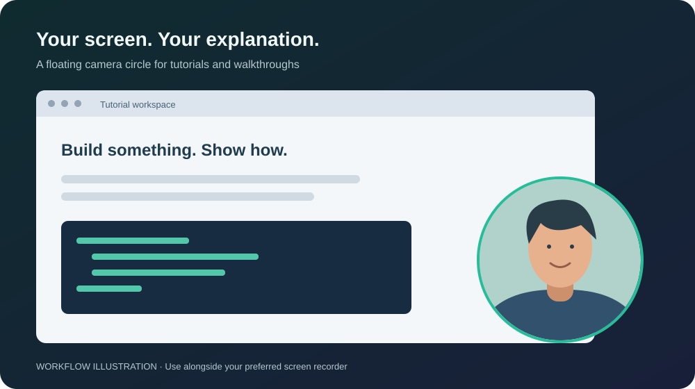

# BubbleCam

A small, always-on-top camera circle for tutorial videos, screen recordings,
software demos, and presentations. Keep your face visible while you walk
viewers through what's on your screen.

Free to use, modify, and share under the [MIT License](LICENSE.md), including
for commercial projects.



*Illustration of the intended workflow, not an app screenshot. Window controls
and appearance can vary by operating system.*

## What it does

- Displays your default camera in a circular, mirrored preview.
- Keeps the camera window above ordinary application windows.
- Lets you drag the circle to a convenient spot on your desktop.
- Shows helpful messages when camera access fails.

Use it when recording coding tutorials, explaining slides, demonstrating a
product, or giving a walkthrough. The app only displays your camera: use a
separate screen recorder to capture your screen and microphone. It does not
record, save, or upload video, and it does not request microphone access.

## Use with a screen recorder

1. Open BubbleCam and allow camera access when prompted.
2. Drag the camera circle away from the content you want to show.
3. In your recording tool, select the display that contains both your content
   and the camera circle. Capturing only another application's window may
   leave the circle out.
4. Make a short test recording to confirm the circle is included, then record
   your tutorial or demo.
5. Close the camera window when finished to stop camera capture. On macOS,
   use **Cmd + Q** to quit the app completely.

There is currently no camera selector, built-in recorder, or microphone control.
Fullscreen apps and recording tools can handle floating windows differently;
check your recording preview before starting.

## Run from source

Install [Node.js](https://nodejs.org/) with npm (Node.js 22 or newer) and Git.
A connected camera is required to show a live preview.

```sh
git clone https://github.com/mrSingh007/BubbleCam.git bubblecam
cd bubblecam
npm ci
npm start
```

The first dependency installation needs internet access to download Electron
and the build tools.

## Build installers

Build on the operating system you want to use: macOS for the DMG
and Windows for the Windows installer. Run `npm ci` first as shown above.
Build tools may download additional platform resources on their first run.

### macOS

```sh
npm run build:mac
```

This creates a `.dmg` in `dist/` for the build machine's architecture. To choose
an architecture explicitly:

```sh
# Apple silicon
npm run build:mac -- --arm64

# Intel
npm run build:mac -- --x64
```

The macOS package includes a camera usage description for the permission prompt.

### Windows

Run in PowerShell or Command Prompt on Windows:

```sh
npm run build:win
```

This creates a 64-bit NSIS `.exe` installer in `dist/`.

`npm run build` is also available to build the configured target for your
current platform. Supported installer targets in this repository are macOS
DMG and Windows NSIS. Windows behavior still needs manual verification.

## Install

No signed releases are provided. GitHub Actions retains unsigned CI installers
for seven days in each successful workflow run's artifacts. To build locally:

1. Clone the repository and enter its directory as shown above.
2. Run `npm ci` to install dependencies.
3. Run `npm run build:mac` on macOS or `npm run build:win` on Windows.
4. Open the generated installer in `dist/` and follow the steps below.

| Platform | Installation |
| --- | --- |
| macOS | Open the `.dmg` in `dist/`, drag the app into **Applications**, then open it from there. Choose the build matching your Mac's processor. |
| Windows | Run the `.exe` installer in `dist/`, complete any installer prompts, then launch the app from the Start menu. |

Allow camera access on first launch. Signing and macOS notarization credentials
are not configured in this repository; locally built installers may trigger
operating-system security prompts.

## Troubleshooting

- **Camera access denied:** enable camera access for the app in your operating
  system's privacy settings, then reopen it. On Windows, also check camera
  access for desktop apps.
- **No camera found:** connect or enable a camera, then reopen the app.
- **Camera unavailable:** close other apps using the camera and try again.
- **Circle missing from a recording:** use display capture and check the
  recorder's preview; a capture of one application may exclude the overlay.

## Development and testing

```sh
npm test
```

Tests cover camera startup, permission and device errors, playback failure,
and stream cleanup, including permission resolving after the window closes.
They use browser mocks and do not access your camera.

### Continuous integration

[CI](.github/workflows/ci.yml) runs when a pull request targeting `main` is
opened, updated, or reopened, and on every push to `main`, including merges.
It can also be started manually from the Actions tab. Each platform job uses
Node.js 22 and `npm ci`, runs the tests, then builds installers: macOS DMGs
for Apple silicon and Intel, and a Windows x64 NSIS installer. Failed tests
prevent packaging in that job. Superseded PR runs are cancelled.

CI installers are unsigned and retained for seven days; CI does not publish
releases. GitHub Actions dependencies are pinned to commit hashes and checked
weekly by Dependabot.

To enforce validation before merging, configure a GitHub branch ruleset for
`main` to require pull requests, up-to-date branches, and both status checks:
`Test and build (macOS)` and `Test and build (Windows)`. The workflow itself
does not enable branch protection. Post-merge runs verify the integrated branch.

### Manual checks

After building and installing, test on your operating system:

- Allow and deny camera permission and check the resulting preview or message.
- Verify the mirrored video fills the circle and that the window can be dragged.
- Check that the overlay appears in a short screen recording.
- Close the window and confirm camera capture stops.
- Repeat these checks with the installed build.

Build configuration lives in `package.json`. Build outputs are written to
`dist/`. See the [electron-builder CLI reference](https://www.electron.build/cli.html)
for additional packaging options.

## License

[MIT](LICENSE.md). Personal and commercial use, modification, and distribution
are permitted. Include the copyright and license notice with copies or
substantial portions of the software. The software is provided without warranty.
